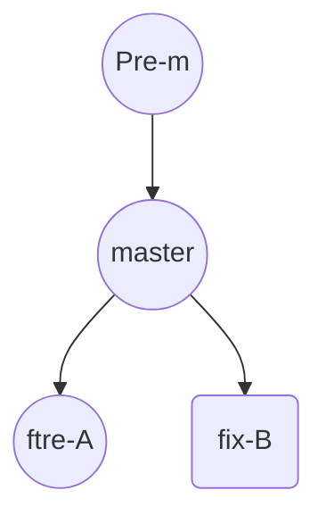
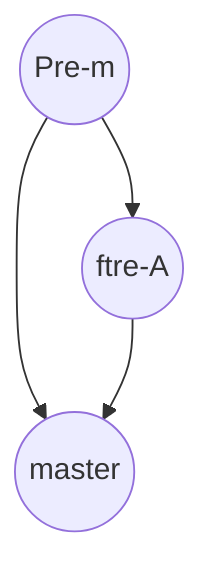
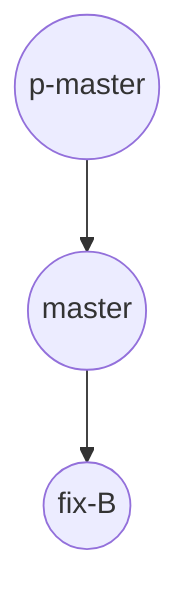
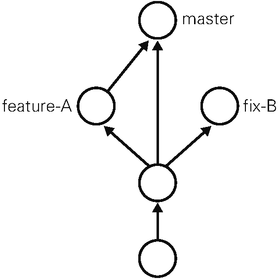

# 第四章　通过实际操作学习Git

## 4.1　基本操作

### git init——初始化仓库

&emsp;&emsp;要使用 Git 进行版本管理，必须先初始化仓库。Git 是使用 git init命令进行初始化的。请实际建立一个目录并初始化仓库。

```shell
$ mkdir git-tutorial
$ cd git-tutorial
$ git init
Initialized empty Git repository in /Users/hirocaster/github/github-book
/git-tutorial/.git/
```

&emsp;&emsp;如果初始化成功，执行了 git init命令的目录下就会生成 .git 目录。这个 .git 目录里存储着管理当前目录内容所需的仓库数据。
&emsp;&emsp;在 Git 中，我们将这个目录的内容称为“附属于该仓库的工作树”。文件的编辑等操作在工作树中进行，然后记录到仓库中，以此管理文件的历史快照。如果想将文件恢复到原先的状态，可以从仓库中调取之前的快照，在工作树中打开。开发者可以通过这种方式获取以往的文件。

### git status——查看仓库的状态

&emsp;&emsp;git status命令用于显示 Git 仓库的状态。这是一个十分常用的命令，请务必牢记。
&emsp;&emsp;工作树和仓库在被操作的过程中，状态会不断发生变化。

```shell
$ git status
# On branch master
#
# Initial commit
#
nothing to commit (create/copy files and use "git add" to track)
```

&emsp;&emsp;结果显示了我们当前正处于 master 分支下。接着还显示了没有可提交的内容。所谓提交（Commit），是指“记录工作树中所有文件的当前状态”。
&emsp;&emsp;现在尚没有可提交的内容，就是说当前我们建立的这个仓库中还没有记录任何文件的任何状态。这里，我们建立 README.md 文件作为管理对象，为第一次提交做前期准备。

```shell
$ touch README.md
$ git status
# On branch master
#
# Initial commit
## Untracked files:#   (use "git add <file>..." to include in what will
be committed)#
#       README.md
nothing added to commit but untracked files present (use "git add" to track)
```

&emsp;&emsp;将 README . md 文件加入暂存区后，git status命令的显示结果发生了变化。可以看到，README . md 文件显示在 Changes to be committed 中了。

### git commit——保存仓库的历史记录

&emsp;&emsp;git commit命令可以将当前暂存区中的文件实际保存到仓库的历史记录中。通过这些记录，我们就可以在工作树中复原文件。

#### 记述一行提交信息

```shell
$ git commit -m "First commit"
[master (root-commit) 9f129ba] First commit
  1 file changed, 0 insertions(+), 0 deletions(-)
  create mode 100644 README.md
```

-m 参数后的 "First commit"称作提交信息，是对这个提交的概述。

#### 记述详细提交信息

&emsp;&emsp;刚才只简洁地记述了一行提交信息，如果想要记述得更加详细，请不加 -m，直接执行 git commit 命令。执行后编辑器就会启动，并显示如下结果。

```shell
# Please enter the commit message for your changes. Lines starting
# with '#' will be ignored, and an empty message aborts the commit.
# On branch master
#
# Initial commit
#
# Changes to be committed:
#   (use "git rm --cached <file>..." to unstage)
#
#       new file:   README.md
```

在编辑器中记述提交信息的格式如下：

+ 第一行：用一行文字简述提交的更改内容
+ 第二行：空行
+ 第三行以后：记述更改的原因和详细内容

&emsp;&emsp;只要按照上面的格式输入，今后便可以通过确认日志的命令或工具看到这些记录。
&emsp;&emsp;在以 #（井号）标为注释的 Changes to be committed（要提交的更改）栏中，可以查看本次提交中包含的文件。将提交信息按格式记述完毕后，请保存并关闭编辑器，以 #（井号）标为注释的行不必删除。随后，刚才记述的提交信息就会被提交。

#### 中止提交

&emsp;&emsp;如果在编辑器启动后想中止提交，请将提交信息留空并直接关闭编辑器，随后提交就会被中止。

#### 查看提交后的状态

&emsp;&emsp;执行完 git commit命令后再来查看当前状态。

```shell
$ git status
# On branch master
nothing to commit, working directory clean
```

&emsp;&emsp;当前工作树处于刚刚完成提交的最新状态，所以结果显示没有更改。

### git log——查看提交日志

&emsp;&emsp;git log命令可以查看以往仓库中提交的日志。包括可以查看什么人在什么时候进行了提交或合并，以及操作前后有怎样的差别。

```shell
$ git log
    　
commit 9f129bae19b2c82fb4e98cde5890e52a6c546922
Author: hirocaster <hohtsuka@gmail.com>
Date:   Sun May 5 16:06:49 2013 +0900
    　
    First commit
```

#### 只显示提交信息的第一行

&emsp;&emsp;如果只想让程序显示第一行简述信息，可以在 git log命令后加上 --pretty=short。这样一来开发人员就能够更轻松地把握多个提交。

```shell
$ git log --pretty=short
        　
commit 9f129bae19b2c82fb4e98cde5890e52a6c546922
Author: hirocaster <hohtsuka@gmail.com>
        　
    First commit
```

#### 只显示指定目录、文件的日志

&emsp;&emsp;只要在 git log命令后加上目录名，便会只显示该目录下的日志。如果加的是文件名，就会只显示与该文件相关的日志。

```shell
git log README.md
```

#### 显示文件的改动

如果想查看提交所带来的改动，可以加上 -p参数，文件的前后差别就会显示在提交信息之后。

```shell
git log -p
```

&emsp;&emsp;执行下面的命令，就可以只查看 README.md 文件的提交日志以及提交前后的差别。

```shell
git log -p README.md
```

### git diff——查看更改前后的差别

&emsp;&emsp;git diff命令可以查看工作树、暂存区、最新提交之间的差别。

#### 查看工作树和暂存区的差别

&emsp;&emsp;执行 git diff 命令，查看当前工作树与暂存区的差别。

```shell
$ git diff
        　
diff --git a/README.md b/README.md
index e69de29..cb5dc9f 100644
--- a/README.md
+++ b/README.md
@@ -0,0 +1 @@
+# Git教程
```

&emsp;&emsp;由于我们尚未用 git add 命令向暂存区添加任何东西，所以程序只会显示工作树与最新提交状态之间的差别。
&emsp;&emsp;“+”号标出的是新添加的行，被删除的行则用“-”号标出。我们可以看到，这次只添加了一行。

#### 查看工作树和最新提交的差别

&emsp;&emsp;如果现在执行 git diff 命令，由于工作树和暂存区的状态并无差别，结果什么都不会显示。要查看与最新提交的差别，请执行以下命令。

```shell
$ git diff HEAD
diff --git a/README.md b/README.md
index e69de29..cb5dc9f 100644
--- a/README.md
+++ b/README.md
@@ -0,0 +1 @@
+# Git教程
```

&emsp;&emsp;不妨养成这样一个好习惯：在执行 git commit 命令之前先执行 git diff HEAD 命令，查看本次提交与上次提交之间有什么差别，等确认完毕后再进行提交。这里的 HEAD 是指向当前分支中最新一次提交的指针。

## 4.2　分支的操作

&emsp;&emsp;在进行多个并行作业时，我们会用到分支。在这类并行开发的过程中，往往同时存在多个最新代码状态。从 master 分支创建 feature-A 分支和 fix-B 分支后，每个分支中都拥有自己的最新代码。master 分支是 Git 默认创建的分支，因此基本上所有开发都是以这个分支为中心进行的。



&emsp;&emsp;不同分支中，可以同时进行完全不同的作业。等该分支的作业完成之后再与 master 分支合并。通过灵活运用分支，可以让多人同时高效地进行并行开发。


### git branch——显示分支一览表

&emsp;&emsp;git branch命令可以将分支名列表显示，同时可以确认当前所在分支。

```shell
$ git branch
* master
```

&emsp;&emsp;可以看到 master 分支左侧标有“*”（星号），表示这是我们当前所在的分支。也就是说，我们正在 master 分支下进行开发。结果中没有显示其他分支名，表示本地仓库中只存在 master 一个分支。

### git checkout -b——创建、切换分支

&emsp;&emsp;如果想以当前的 master 分支为基础创建新的分支，我们需要用到 `git checkout -b`命令。

#### 切换到 feature-A 分支并进行提交

&emsp;&emsp;执行下面的命令，创建名为 feature-A 的分支。

```shell
$ git checkout -b feature-A
Switched to a new branch 'feature-A'
```

&emsp;&emsp;连续执行下面两条命令也能收到同样效果。

```shell
git branch feature-A
git checkout feature-A
```

&emsp;&emsp;创建 feature-A 分支，并将当前分支切换为 feature-A 分支。这时再来查看分支列表，会显示我们处于 feature-A 分支下。

```shell
$ git branch
* feature-A
  master
```

&emsp;&emsp;feature-A 分支左侧标有 “ * ” ，表示当前分支为 feature-A。在这个状态下像正常开发那样修改代码、执行 git add 命令并进行提交的话，代码就会提交至 feature-A 分支。像这样不断对一个分支（例如 feature-A）进行提交的操作，我们称为“培育分支”。

&emsp;&emsp;我们在README.md中添加了 feature-A 这样一行字母，然后进行提交。

```shell
$ git add README.md
$ git commit -m "Add feature-A"
[feature-A 8a6c8b9] Add feature-A
 1 file changed, 2 insertions(+)
```

&emsp;&emsp;于是，这一行就添加到 feature-A 分支中了。

#### 切换到 master 分支

&emsp;&emsp;现在我们再来看一看 master 分支有没有受到影响。首先切换至 master 分支。

```shell
$ git checkout master
Switched to branch 'master'
```

&emsp;&emsp;然后查看 README . md 文件，会发现 README . md 文件仍然保持原先的状态，并没有被添加文字。feature-A 分支的更改不会影响到 master 分支，这正是在开发中创建分支的优点。只要创建多个分支，就可以在不互相影响的情况下同时进行多个功能的开发。

#### 切换回上一个分支

&emsp;&emsp;现在，我们再切换回 feature-A 分支。

```shell
$ git checkout -
Switched to branch 'feature-A'
```

&emsp;&emsp;像上面这样用“-”（连字符）代替分支名，就可以切换至上一个分支。当然，将“-”替换成 feature-A 同样可以切换到 feature-A 分支。

#### 特性分支

&emsp;&emsp;Git 与 Subversion（SVN）等集中型版本管理系统不同，创建分支时不需要连接中央仓库，所以能够相对轻松地创建分支。因此，当今大部分工作流程中都用到了特性（Topic）分支。

&emsp;&emsp;特性分支顾名思义，是集中实现单一特性（主题），除此之外不进行任何作业的分支。在日常开发中，往往会创建数个特性分支，同时在此之外再保留一个随时可以发布软件的稳定分支。稳定分支的角色通常由 master 分支担当。



&emsp;&emsp;之前我们创建了 feature-A 分支，这一分支主要实现 feature-A，除 feature-A 的实现之外不进行任何作业。即便在开发过程中发现了 BUG，也需要再创建新的分支，在新分支中进行修正。
&emsp;&emsp;基于特定主题的作业在特性分支中进行，主题完成后再与 master 分支合并。只要保持这样一个开发流程，就能保证 master 分支可以随时供人查看。这样一来，其他开发者也可以放心大胆地从 master 分支创建新的特性分支。

#### 主干分支

&emsp;&emsp;主干分支是刚才讲解的特性分支的原点，同时也是合并的终点。通常人们会用 master 分支作为主干分支。主干分支中并没有开发到一半的代码，可以随时供他人查看。
&emsp;&emsp;有时我们需要让这个主干分支总是配置在正式环境中，有时又需要用标签 Tag 等创建版本信息，同时管理多个版本发布。拥有多个版本发布时，主干分支也有多个。

### git merge——合并分支

&emsp;&emsp;接下来，假设 feature-A 已经实现完毕，想要将它合并到主干分支 master 中。首先切换到 master 分支。

```shell
$ git checkout master
Switched to branch 'master'
```

&emsp;&emsp;然后合并 feature-A 分支。为了在历史记录中明确记录下本次分支合并，我们需要创建合并提交。因此，在合并时加上 `--no-ff`参数。

```shell
git merge --no-ff feature-A
```

&emsp;&emsp;随后编辑器会启动，用于录入合并提交的信息。

```shell
Merge branch 'feature-A'
    　
# Please enter a commit message to explain why this merge is necessary,
# especially if it merges an updated upstream into a topic branch.
#
# Lines starting with '#' will be ignored, and an empty message aborts
# the commit.
```

&emsp;&emsp;默认信息中已经包含了是从 feature-A 分支合并过来的相关内容，所以可不必做任何更改。将编辑器中显示的内容保存，关闭编辑器，然后就会看到下面的结果。

```shell
Merge made by the 'recursive' strategy.
 README.md | 2 ++
 1 file changed, 2 insertions(+)
```

&emsp;&emsp;这样一来，feature-A 分支的内容就合并到 master 分支中了。

#### git log --graph——以图表形式查看分支

&emsp;&emsp;用 `git log --graph` 命令进行查看的话，能很清楚地看到特性分支（feature-A）提交的内容已被合并。除此以外，特性分支的创建以及合并也都清楚明了。`git log --graph` 命令可以用图表形式输出提交日志，非常直观。

## 4.3　更改提交的操作

### git reset——回溯历史版本

&emsp;&emsp;Git 的另一特征便是可以灵活操作历史版本。借助分散仓库的优势，可以在不影响其他仓库的前提下对历史版本进行操作。我们先回溯历史版本，创建一个名为 fix-B 的特性分支。


#### 回溯到创建 feature-A 分支前

要让仓库的 HEAD、暂存区、当前工作树回溯到指定状态，需要用到 git reset --hard命令。只要提供目标时间点的哈希值 ，就可以完全恢复至该时间点的状态。

> 哈希值在每个环境中各不相同，读者请查看自身当前环境中 Add index 的哈希值，进行替换。

```shell
$ git reset --hard fd0cbf0d4a25f747230694d95cac1be72d33441d
HEAD is now at fd0cbf0 Add index
```

&emsp;&emsp;我们已经成功回溯到特性分支（feature-A）创建之前的状态。由于所有文件都回溯到了指定哈希值对应的时间点上，README . md 文件的内容也恢复到了当时的状态。

#### 创建 fix-B 分支

+ 创建特性分支（fix-B）

```shell
$ git checkout -b fix-B
Switched to a new branch 'fix-B'
```

+ 作为这个主题的作业内容

```md
# Git教程
        　
  - fix-B
```

+ 然后直接提交 README . md 文件

```shell
$ git add README.md
        　
$ git commit -m "Fix B"
[fix-B 4096d9e] Fix B
 1 file changed, 2 insertions(+)
```

+ 现在的状态如图所示



#### 推进至 feature-A 分支合并后的状态

&emsp;&emsp;首先恢复到 feature-A 分支合并后的状态。这一操作为 “ 推进历史 ” 。`git log` 命令只能查看以当前状态为终点的历史日志。所以这里要使用 `git reflog` 命令，查看当前仓库的操作日志。在日志中找出回溯历史之前的哈希值，通过 `git reset --hard` 命令恢复到回溯历史前的状态。

+ 首先执行 `git reflog` 命令，查看当前仓库执行过的操作的日志

```shell
$ git reflog
4096d9e HEAD@{0}: commit: Fix B
fd0cbf0 HEAD@{1}: checkout: moving from master to fix-B
fd0cbf0 HEAD@{2}: reset: moving to fd0cbf0d4a25f747230694d95cac1be72d33441d
83b0b94 HEAD@{3}: merge feature-A: Merge made by the 'recursive' strategy.
fd0cbf0 HEAD@{4}: checkout: moving from feature-A to master
8a6c8b9 HEAD@{5}: checkout: moving from master to feature-A
fd0cbf0 HEAD@{6}: checkout: moving from feature-A to master
8a6c8b9 HEAD@{7}: commit: Add feature-A
fd0cbf0 HEAD@{8}: checkout: moving from master to feature-A
fd0cbf0 HEAD@{9}: commit: Add index
9f129ba HEAD@{10}: commit (initial): First commit
```

&emsp;&emsp;在日志中，我们可以看到 `commit`、`checkout`、`reset`、`merge` 等 Git 命令的执行记录。只要不进行 Git 的 GC（Garbage Collection，垃圾回收），就可以通过日志随意调取近期的历史状态，就像给时间机器指定一个时间点，在过去未来中自由穿梭一般。即便开发者错误执行了 Git 操作，基本也都可以利用 `git reflog` 命令恢复到原先的状态，所以请务必牢记本部分。
&emsp;&emsp;从上面数第四行表示 feature-A 特性分支合并后的状态，对应哈希值为 83b0b94。我们将 HEAD、暂存区、工作树恢复到这个时间点的状态。

> 哈希值只要输入 4 位以上就可以执行。

```shell
$ git checkout master
        　
$ git reset --hard 83b0b94
HEAD is now at 83b0b94 Merge branch 'feature-A'
```

&emsp;&emsp;之前我们使用 `git reset --hard` 命令回溯了历史，这里又再次通过它恢复到了回溯前的历史状态。



#### 消除冲突

&emsp;&emsp;现在只要合并 fix-B 分支，就可以得到我们想要的状态。

```shell
$ git merge --no-ff fix-B
Auto-merging README.md
CONFLICT (content): Merge conflict in README.md
Recorded preimage for 'README.md'
Automatic merge failed; fix conflicts and then commit the result.
```

&emsp;&emsp;这时，系统告诉我们 README . md 文件发生了冲突（Conflict）。系统在合并 README . md 文件时，feature-A 分支更改的部分与本次想要合并的 fix-B 分支更改的部分发生了冲突。不解决冲突就无法完成合并，所以我们打开 README . md 文件，解决这个冲突。

#### 查看冲突部分并将其解决

+ 用编辑器打开 README.md 文件，查看

```md
# Git教程
        　
< < < < < < <  HEAD
  - feature-A
=======
  - fix-B
> > > > > > >  fix-B
```

&emsp;&emsp;======= 以上的部分是当前 HEAD 的内容，以下的部分是要合并的 fix-B 分支中的内容。我们在编辑器中将其改成想要的样子。

```md
# Git教程
        　
  - feature-A
  - fix-B
```

&emsp;&emsp;本次修正让 feature-A 与 fix-B 的内容并存于文件之中。但是在实际的软件开发中，往往需要删除其中之一，所以在处理冲突时，务必要仔细分析冲突部分的内容后再行修改。

#### 提交解决后的结果

+ 冲突解决后，执行 `git add` 命令与 `git commit` 命令

```shell
$ git add README.md
        　
$ git commit -m "Fix conflict"
Recorded resolution for 'README.md'.
[master 6a97e48] Fix conflict
```

&emsp;&emsp;由于本次更改解决了冲突，所以提交信息记为 "Fix conflict"。

### git commit --amend——修改提交信息

&emsp;&emsp;要修改上一条提交信息，可以使用 `git commit --amend`命令。将上一条提交信息记为了 " Fix conflict "，但它其实是 fix-B 分支的合并，解决合并时发生的冲突只是过程之一，这样标记实在不妥。于是，要修改这条提交信息。

```shell
git commit --amend
```

执行命令后，编辑器就会启动。

```shell
Fix conflict
    　
# Please enter the commit message for your changes. Lines starting
# with '#' will be ignored, and an empty message aborts the commit.
# On branch master
# Changes to be committed:
#   (use "git reset HEAD^1 <file>..." to unstage)
#
#       modified:   README.md
#
```

&emsp;&emsp;编辑器中显示的内容：包含之前的提交信息。请将提交信息的部分修改为 Merge branch 'fix-B'，然后保存文件，关闭编辑器。

```shell
[master 2e7db6f] Merge branch 'fix-B'
```

&emsp;&emsp;现在执行 `git log --graph` 命令，可以看到提交日志中的相应内容也已经被修改。

### git rebase -i——压缩历史

&emsp;&emsp;在合并特性分支之前，如果发现已提交的内容中有些许拼写错误等，不妨提交一个修改，然后将这个修改包含到前一个提交之中，压缩成一个历史记录。这是个会经常用到的技巧。

#### 创建 feature-C 分支

+ 新建一个 feature-C 特性分支

```shell
$ git checkout -b feature-C
Switched to a new branch 'feature-C'
```

&emsp;&emsp;作为 feature-C 的功能实现，在 README . md 文件中添加一行文字，并且故意留下拼写错误，以便之后修正。

```md
# Git教程

  - feature-A
  - fix-B
  - faeture-C
```

&emsp;&emsp;提交这部分内容。这个小小的变更就没必要先执行 `git add` 命令再执行 `git commit` 命令了，我们用 `git commit -am` 命令来一次完成这两步操作。

```shell
$ git commit -am "Add feature-C"
[feature-C 7a34294] Add feature-C
 1 file changed, 1 insertion(+)
```

#### 修正拼写错误

+ 修正刚才预留的拼写错误

```shell
$ git diff
diff --git a/README.md b/README.md
index ad19aba..af647fd 100644
--- a/README.md
+++ b/README.md
@@ -2,4 +2,4 @@
        　
   - feature-A
   - fix-B
-  - faeture-C
+  - feature-C
```

+ 然后进行提交

```shell
$ git commit -am "Fix typo"
[feature-C 6fba227] Fix typo
 1 file changed, 1 insertion(+), 1 deletion(-)
```

&emsp;&emsp;错字漏字等失误称作 typo，所以我们将提交信息记为 " Fix typo"。实际上，我们不希望在历史记录中看到这类提交，因为健全的历史。如果能在最初提交之前就发现并修正这些错误，也就不会出现这类提交了。

#### 更改历史

&emsp;&emsp;将 " Fix typo " 修正的内容与之前一次的提交合并，在历史记录中合并为一次完美的提交。为此，我们要用到 `git rebase` 命令。

```shell
git rebase -i HEAD~2
```

&emsp;&emsp;用上述方式执行 `git rebase` 命令，可以选定当前分支中包含 HEAD（最新提交）在内的两个最新历史记录为对象，并在编辑器中打开。

```shell
pick 7a34294 Add feature-C
pick 6fba227 Fix typo

# Rebase 2e7db6f..6fba227 onto 2e7db6f
#
# Commands:
#  p, pick = use commit
#  r, reword = use commit, but edit the commit message
#  e, edit = use commit, but stop for amending
#  s, squash = use commit, but meld into previous commit
#  f, fixup = like "squash", but discard this commit's log message
#  x, exec = run command (the rest of the line) using shell
#
# These lines can be re-ordered; they are executed from top to bottom.
#
# If you remove a line here THAT COMMIT WILL BE LOST.
#
# However, if you remove everything, the rebase will be aborted.
#
# Note that empty commits are commented out
```

&emsp;&emsp;将 6fba227 的 Fix typo 的历史记录压缩到 7a34294 的 Add feature-C 里。按照下图所示，将 6fba227 左侧的 pick 部分删除，改写为 fixup。

```shell
pick 7a34294 Add feature-C
fixup 6fba227 Fix typo
```

保存编辑器里的内容，关闭编辑器。

```shell
[detached HEAD 51440c5] Add feature-C
 1 file changed, 1 insertion(+)
Successfully rebased and updated refs/heads/feature-C.
```

&emsp;&emsp;系统显示 rebase 成功。也就是以下面这两个提交作为对象，将 "Fix typo"的内容合并到了上一个提交 "Add feature-C"中，改写成了一个新的提交。现在再查看提交日志时会发现 Add feature-C 的哈希值已经不是 7a34294 了，这证明提交已经被更改。
&emsp;&emsp;这样一来，Fix typo 就从历史中被抹去，也就相当于 Add feature-C 中从来没有出现过拼写错误。这算是一种良性的历史改写。

#### 合并至 master 分支

```shell
$ git checkout master
Switched to branch 'master'
        　
$ git merge --no-ff feature-C
Merge made by the 'recursive' strategy.
 README.md | 1 +
 1 file changed, 1 insertion(+)
```

## 4.4　推送至远程仓库

&emsp;&emsp;Git 是分散型版本管理系统，但前面所学习的，都是针对单一本地仓库的操作。下面，将开始接触远在网络另一头的远程仓库。远程仓库顾名思义，是与本地仓库相对独立的另一个仓库。先在 GitHub 上创建一个仓库，并将其设置为本地仓库的远程仓库。
&emsp;&emsp;参考第 3 章的 3.2 节在 GitHub 上新建一个仓库。为防止与其他仓库混淆，仓库名请与本地仓库保持一致，即 git-tutorial。创建时请不要勾选 Initialize this repository with a README 选项。因为一旦勾选该选项，GitHub 一侧的仓库就会自动生成 README 文件，从创建之初便与本地仓库失去了整合性。虽然到时也可以强制覆盖，但为防止这一情况发生还是建议不要勾选该选项，直接点击 Create repository 创建仓库。

### git remote add——添加远程仓库

&emsp;&emsp;在 GitHub 上创建的仓库路径为“git@github.com:用户名/git-tutorial.git”。现在用 `git remote add`命令将它设置成本地仓库的远程仓库。

> 本节讲解中使用的用户名为 github-book，读者请根据自身环境予以替换。

```shell
git remote add origin git@github.com:github-book/git-tutorial.git
```

&emsp;&emsp;按照上述格式执行 `git remote add` 命令之后，Git 会自动将 `git@github.com:github-book/git-tutorial.git`远程仓库的名称设置为 origin（标识符）。

### git push——推送至远程仓库

#### 推送至 master 分支

&emsp;&emsp;如果想将当前分支下本地仓库中的内容推送给远程仓库，需要用到 `git push` 命令。现在假定在 master 分支下进行操作。

```shell
$ git push -u origin master
Counting objects: 20, done.
Delta compression using up to 8 threads.
Compressing objects: 100% (10/10), done.
Writing objects: 100% (20/20), 1.60 KiB, done.
Total 20 (delta 3), reused 0 (delta 0)
To git@github.com:github-book/git-tutorial.git
 * [new branch]      master -> master
Branch master set up to track remote branch master from origin.
```

&emsp;&emsp;像这样执行 `git push`命令，当前分支的内容就会被推送给远程仓库 origin 的 master 分支。-u参数可以在推送的同时，将 origin 仓库的 master 分支设置为本地仓库当前分支的 upstream（上游）。添加了这个参数，将来运行 git pull命令从远程仓库获取内容时，本地仓库的这个分支就可以直接从 origin 的 master 分支获取内容，省去了另外添加参数的麻烦。
&emsp;&emsp;执行该操作后，当前本地仓库 master 分支的内容将会被推送到 GitHub 的远程仓库中。在 GitHub 上也可以确认远程 master 分支的内容和本地 master 分支相同。

#### 推送至 master 以外的分支

&emsp;&emsp;除了 master 分支之外，远程仓库也可以创建其他分支。

```shell
$ git checkout -b feature-D
Switched to a new branch 'feature-D'
```

&emsp;&emsp;在本地仓库中创建了 feature-D 分支，现在将它 push 给远程仓库并保持分支名称不变。

```shell
$ git push -u origin feature-D
Total 0 (delta 0), reused 0 (delta 0)
To git@github.com:github-book/git-tutorial.git
 * [new branch]      feature-D -> feature-D
Branch feature-D set up to track remote branch feature-D from origin.
```

## 4.5　从远程仓库获取

&emsp;&emsp;上一节把在 GitHub 上新建的仓库设置成了远程仓库，并向这个仓库 push 了 feature-D 分支。现在，所有能够访问这个远程仓库的人都可以获取 feature-D 分支并加以修改。
&emsp;&emsp;本节从实际开发者的角度出发，在另一个目录下新建一个本地仓库，学习从远程仓库获取内容的相关操作。这就相当于刚刚执行过 push 操作的目标仓库又有了另一名新开发者来共同开发。

### git clone——获取远程仓库

#### 获取远程仓库

&emsp;&emsp;首先换到其他目录下，将 GitHub 上的仓库 clone 到本地。注意不要与之前操作的仓库在同一目录下。

```shell
$ git clone git@github.com:github-book/git-tutorial.git
Cloning into 'git-tutorial'...
remote: Counting objects: 20, done.
remote: Compressing objects: 100% (7/7), done.
remote: Total 20 (delta 3), reused 20 (delta 3)
Receiving objects: 100% (20/20), done.
Resolving deltas: 100% (3/3), done.
$ cd git-tutorial
```

&emsp;&emsp;执行 `git clone` 命令后我们会默认处于 master 分支下，同时系统会自动将 origin 设置成该远程仓库的标识符。也就是说，当前本地仓库的 master 分支与 GitHub 端远程仓库（origin）的 master 分支在内容上是完全相同的。

```shell
$ git branch -a
* master
  remotes/origin/HEAD -> origin/master
  remotes/origin/feature-D
  remotes/origin/master
```

&emsp;&emsp;用 `git branch -a`命令查看当前分支的相关信息。添加 `-a` 参数可以同时显示本地仓库和远程仓库的分支信息。
&emsp;&emsp;结果中显示了 `remotes/origin/feature-D`，证明远程仓库中已经有了 feature-D 分支。

#### 获取远程的 feature-D 分支

+ 将 feature-D 分支获取至本地仓库

```shell
$ git checkout -b feature-D origin/feature-D
Branch feature-D set up to track remote branch feature-D from origin.
Switched to a new branch 'feature-D'
```

&emsp;&emsp;`-b` 参数的后面是本地仓库中新建分支的名称。为了便于理解，仍将其命名为 feature-D，让它与远程仓库的对应分支保持同名。新建分支名称后面是获取来源的分支名称。例子中指定了 origin/feature-D，就是说以名为 origin 的仓库（这里指 GitHub 端的仓库）的 feature-D 分支为来源，在本地仓库中创建 feature-D 分支。

#### 向本地的 feature-D 分支提交更改

&emsp;&emsp;现在假定我们是另一名开发者，要做一个新的提交。在 README . md 文件中添加一行文字，查看更改。

```shell
$ git diff
diff --git a/README.md b/README.md
index af647fd..30378c9 100644
--- a/README.md
+++ b/README.md
@@ -3,3 +3,4 @@
   - feature-A
   - fix-B
   - feature-C
+  - feature-D
```

&emsp;&emsp;按照之前学过的方式提交即可。

```shell
$ git commit -am "Add feature-D"
[feature-D ed9721e] Add feature-D
 1 file changed, 1 insertion(+)
```

#### 推送 feature-D 分支

+ 推送 feature-D 分支

```shell
$ git push
Counting objects: 5, done.
Delta compression using up to 8 threads.
Compressing objects: 100% (2/2), done.
Writing objects: 100% (3/3), 281 bytes, done.
Total 3 (delta 1), reused 0 (delta 0)
To git@github.com:github-book/git-tutorial.git
   ca0f98b..ed9721e feature-D -> feature-D
```

&emsp;&emsp;从远程仓库获取 feature-D 分支，在本地仓库中提交更改，再将 feature-D 分支推送回远程仓库，通过这一系列操作，就可以与其他开发者相互合作，共同培育 feature-D 分支，实现某些功能。

### git pull——获取最新的远程仓库分支

&emsp;&emsp;回到原先的那个目录下。这边的本地仓库中只创建了 feature-D 分支，并没有在 feature-D 分支中进行任何提交。然而远程仓库的 feature-D 分支中已经有了刚刚推送的提交。这时我们就可以使用 `git pull` 命令，将本地的 feature-D 分支更新到最新状态。当前分支为 feature-D 分支。

```shell
$ git pull origin feature-D
remote: Counting objects: 5, done.
remote: Compressing objects: 100% (1/1), done.
remote: Total 3 (delta 1), reused 3 (delta 1)
Unpacking objects: 100% (3/3), done.
From github.com:github-book/git-tutorial
 * branch            feature-D -> FETCH_HEAD
 First, rewinding head to replay your work on top of it...
 Fast-forwarded feature-D to ed9721e686f8c588e55ec6b8071b669f411486b8.
```

&emsp;&emsp;GitHub 端远程仓库中的 feature-D 分支是最新状态，所以本地仓库中的 feature-D 分支就得到了更新。今后只需要像平常一样在本地进行提交再 push 给远程仓库，就可以与其他开发者同时在同一个分支中进行作业，不断给 feature-D 增加新功能。
&emsp;&emsp;如果两人同时修改了同一部分的源代码，push 时就很容易发生冲突。所以多名开发者在同一个分支中进行作业时，为减少冲突情况的发生，建议更频繁地进行 push 和 pull 操作。

## 4.6　帮助大家深入理解 Git 的资料

&emsp;&emsp;至此为止，阅读并理解所必需的 Git 操作已经全部讲解完了。但是在实际的开发现场，往往要用到更加高级的 Git 操作。这里介绍一些参考资料，能够帮助各位深入理解 Git 的相关知识。

### Pro Git

&emsp;&emsp;由就职于 GitHub 公司的 Scott Chacon 执笔，是一部零基础的 Git 学习资料。基于知识共享的 CC BY-NC-SA 3.0 许可协议，各位可以免费阅读到包括简体中文在内的各国语言版本。

> Pro Git：<http://git-scm.com/book/zh/v1>  
> Scott Chacon：<https://github.com/schacon>

### LearnGitBranching

&emsp;&emsp;是学习 Git 基本操作的网站。注重树形结构的学习方式非常适合初学者使用，点击右下角的地球标志还可切换各种语言进行学习。

> LearnGitBranching：<http://pcottle.github.io/learnGitBranching/>

### tryGit

&emsp;&emsp;可以在 Web 上一边操作一边学习 Git 的基本功能。很可惜该教程只有英文版。

> tryGit：<http://try.github.io/>

## 4.7　小结

&emsp;&emsp;本文就理解本书所必需的 Git 操作进行了讲解。只要掌握了本文的知识，就足以应付日常开发中的大部分操作了。遇到不常用的特殊操作时，还请各位读者查阅本书介绍的参考资料，确保操作的正确性。
