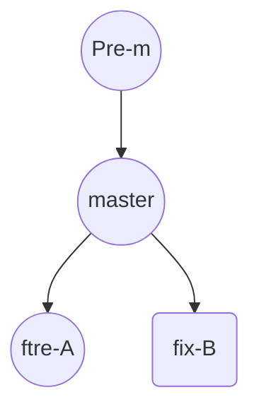
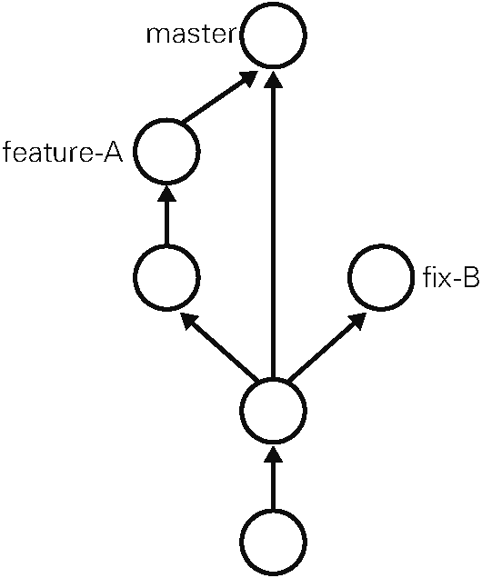
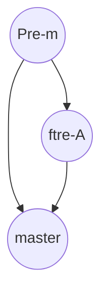
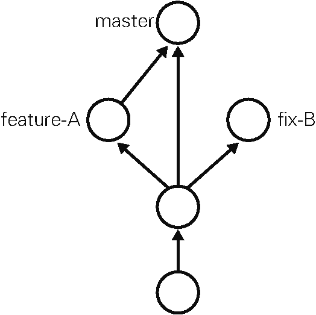

# 第四章　通过实际操作学习Git

## 4.1　基本操作

### git init——初始化仓库

&emsp;&emsp;要使用 Git 进行版本管理，必须先初始化仓库。Git 是使用 git init命令进行初始化的。请实际建立一个目录并初始化仓库。

```shell
$ mkdir git-tutorial
$ cd git-tutorial
$ git init
Initialized empty Git repository in /Users/hirocaster/github/github-book
/git-tutorial/.git/
```

&emsp;&emsp;如果初始化成功，执行了 git init命令的目录下就会生成 .git 目录。这个 .git 目录里存储着管理当前目录内容所需的仓库数据。
&emsp;&emsp;在 Git 中，我们将这个目录的内容称为“附属于该仓库的工作树”。文件的编辑等操作在工作树中进行，然后记录到仓库中，以此管理文件的历史快照。如果想将文件恢复到原先的状态，可以从仓库中调取之前的快照，在工作树中打开。开发者可以通过这种方式获取以往的文件。

### git status——查看仓库的状态

&emsp;&emsp;git status命令用于显示 Git 仓库的状态。这是一个十分常用的命令，请务必牢记。
&emsp;&emsp;工作树和仓库在被操作的过程中，状态会不断发生变化。

```shell
$ git status
# On branch master
#
# Initial commit
#
nothing to commit (create/copy files and use "git add" to track)
```

&emsp;&emsp;结果显示了我们当前正处于 master 分支下。接着还显示了没有可提交的内容。所谓提交（Commit），是指“记录工作树中所有文件的当前状态”。
&emsp;&emsp;现在尚没有可提交的内容，就是说当前我们建立的这个仓库中还没有记录任何文件的任何状态。这里，我们建立 README.md 文件作为管理对象，为第一次提交做前期准备。

```shell
$ touch README.md
$ git status
# On branch master
#
# Initial commit
## Untracked files:#   (use "git add <file>..." to include in what will
be committed)#
#       README.md
nothing added to commit but untracked files present (use "git add" to track)
```

&emsp;&emsp;将 README . md 文件加入暂存区后，git status命令的显示结果发生了变化。可以看到，README . md 文件显示在 Changes to be committed 中了。

### git commit——保存仓库的历史记录

&emsp;&emsp;git commit命令可以将当前暂存区中的文件实际保存到仓库的历史记录中。通过这些记录，我们就可以在工作树中复原文件。

#### 记述一行提交信息

```shell
$ git commit -m "First commit"
[master (root-commit) 9f129ba] First commit
  1 file changed, 0 insertions(+), 0 deletions(-)
  create mode 100644 README.md
```

-m 参数后的 "First commit"称作提交信息，是对这个提交的概述。

#### 记述详细提交信息

&emsp;&emsp;刚才只简洁地记述了一行提交信息，如果想要记述得更加详细，请不加 -m，直接执行 git commit 命令。执行后编辑器就会启动，并显示如下结果。

```shell
# Please enter the commit message for your changes. Lines starting
# with '#' will be ignored, and an empty message aborts the commit.
# On branch master
#
# Initial commit
#
# Changes to be committed:
#   (use "git rm --cached <file>..." to unstage)
#
#       new file:   README.md
```

在编辑器中记述提交信息的格式如下：

+ 第一行：用一行文字简述提交的更改内容
+ 第二行：空行
+ 第三行以后：记述更改的原因和详细内容

&emsp;&emsp;只要按照上面的格式输入，今后便可以通过确认日志的命令或工具看到这些记录。
&emsp;&emsp;在以 #（井号）标为注释的 Changes to be committed（要提交的更改）栏中，可以查看本次提交中包含的文件。将提交信息按格式记述完毕后，请保存并关闭编辑器，以 #（井号）标为注释的行不必删除。随后，刚才记述的提交信息就会被提交。

#### 中止提交

&emsp;&emsp;如果在编辑器启动后想中止提交，请将提交信息留空并直接关闭编辑器，随后提交就会被中止。

#### 查看提交后的状态

&emsp;&emsp;执行完 git commit命令后再来查看当前状态。

```shell
$ git status
# On branch master
nothing to commit, working directory clean
```

&emsp;&emsp;当前工作树处于刚刚完成提交的最新状态，所以结果显示没有更改。

### git log——查看提交日志

&emsp;&emsp;git log命令可以查看以往仓库中提交的日志。包括可以查看什么人在什么时候进行了提交或合并，以及操作前后有怎样的差别。

```shell
$ git log
    　
commit 9f129bae19b2c82fb4e98cde5890e52a6c546922
Author: hirocaster <hohtsuka@gmail.com>
Date:   Sun May 5 16:06:49 2013 +0900
    　
    First commit
```

#### 只显示提交信息的第一行

&emsp;&emsp;如果只想让程序显示第一行简述信息，可以在 git log命令后加上 --pretty=short。这样一来开发人员就能够更轻松地把握多个提交。

```shell
$ git log --pretty=short
        　
commit 9f129bae19b2c82fb4e98cde5890e52a6c546922
Author: hirocaster <hohtsuka@gmail.com>
        　
    First commit
```

#### 只显示指定目录、文件的日志

&emsp;&emsp;只要在 git log命令后加上目录名，便会只显示该目录下的日志。如果加的是文件名，就会只显示与该文件相关的日志。

```shell
git log README.md
```

#### 显示文件的改动

如果想查看提交所带来的改动，可以加上 -p参数，文件的前后差别就会显示在提交信息之后。

```shell
git log -p
```

&emsp;&emsp;执行下面的命令，就可以只查看 README.md 文件的提交日志以及提交前后的差别。

```shell
git log -p README.md
```

### git diff——查看更改前后的差别

&emsp;&emsp;git diff命令可以查看工作树、暂存区、最新提交之间的差别。

#### 查看工作树和暂存区的差别

&emsp;&emsp;执行 git diff 命令，查看当前工作树与暂存区的差别。

```shell
$ git diff
        　
diff --git a/README.md b/README.md
index e69de29..cb5dc9f 100644
--- a/README.md
+++ b/README.md
@@ -0,0 +1 @@
+# Git教程
```

&emsp;&emsp;由于我们尚未用 git add 命令向暂存区添加任何东西，所以程序只会显示工作树与最新提交状态之间的差别。
&emsp;&emsp;“+”号标出的是新添加的行，被删除的行则用“-”号标出。我们可以看到，这次只添加了一行。

#### 查看工作树和最新提交的差别

&emsp;&emsp;如果现在执行 git diff 命令，由于工作树和暂存区的状态并无差别，结果什么都不会显示。要查看与最新提交的差别，请执行以下命令。

```shell
$ git diff HEAD
diff --git a/README.md b/README.md
index e69de29..cb5dc9f 100644
--- a/README.md
+++ b/README.md
@@ -0,0 +1 @@
+# Git教程
```

&emsp;&emsp;不妨养成这样一个好习惯：在执行 git commit 命令之前先执行 git diff HEAD 命令，查看本次提交与上次提交之间有什么差别，等确认完毕后再进行提交。这里的 HEAD 是指向当前分支中最新一次提交的指针。

## 4.2　分支的操作

&emsp;&emsp;在进行多个并行作业时，我们会用到分支。在这类并行开发的过程中，往往同时存在多个最新代码状态。从 master 分支创建 feature-A 分支和 fix-B 分支后，每个分支中都拥有自己的最新代码。master 分支是 Git 默认创建的分支，因此基本上所有开发都是以这个分支为中心进行的。



&emsp;&emsp;不同分支中，可以同时进行完全不同的作业。等该分支的作业完成之后再与 master 分支合并。通过灵活运用分支，可以让多人同时高效地进行并行开发。



### git branch——显示分支一览表

&emsp;&emsp;git branch命令可以将分支名列表显示，同时可以确认当前所在分支。

```shell
$ git branch
* master
```

&emsp;&emsp;可以看到 master 分支左侧标有“*”（星号），表示这是我们当前所在的分支。也就是说，我们正在 master 分支下进行开发。结果中没有显示其他分支名，表示本地仓库中只存在 master 一个分支。

### git checkout -b——创建、切换分支

&emsp;&emsp;如果想以当前的 master 分支为基础创建新的分支，我们需要用到 `git checkout -b`命令。

#### 切换到 feature-A 分支并进行提交

&emsp;&emsp;执行下面的命令，创建名为 feature-A 的分支。

```shell
$ git checkout -b feature-A
Switched to a new branch 'feature-A'
```

&emsp;&emsp;连续执行下面两条命令也能收到同样效果。

```shell
git branch feature-A
git checkout feature-A
```

&emsp;&emsp;创建 feature-A 分支，并将当前分支切换为 feature-A 分支。这时再来查看分支列表，会显示我们处于 feature-A 分支下。

```shell
$ git branch
* feature-A
  master
```

&emsp;&emsp;feature-A 分支左侧标有 “ * ” ，表示当前分支为 feature-A。在这个状态下像正常开发那样修改代码、执行 git add 命令并进行提交的话，代码就会提交至 feature-A 分支。像这样不断对一个分支（例如 feature-A）进行提交的操作，我们称为“培育分支”。

&emsp;&emsp;我们在README.md中添加了 feature-A 这样一行字母，然后进行提交。

```shell
$ git add README.md
$ git commit -m "Add feature-A"
[feature-A 8a6c8b9] Add feature-A
 1 file changed, 2 insertions(+)
```

&emsp;&emsp;于是，这一行就添加到 feature-A 分支中了。

#### 切换到 master 分支

&emsp;&emsp;现在我们再来看一看 master 分支有没有受到影响。首先切换至 master 分支。

```shell
$ git checkout master
Switched to branch 'master'
```

&emsp;&emsp;然后查看 README . md 文件，会发现 README . md 文件仍然保持原先的状态，并没有被添加文字。feature-A 分支的更改不会影响到 master 分支，这正是在开发中创建分支的优点。只要创建多个分支，就可以在不互相影响的情况下同时进行多个功能的开发。

#### 切换回上一个分支

&emsp;&emsp;现在，我们再切换回 feature-A 分支。

```shell
$ git checkout -
Switched to branch 'feature-A'
```

&emsp;&emsp;像上面这样用“-”（连字符）代替分支名，就可以切换至上一个分支。当然，将“-”替换成 feature-A 同样可以切换到 feature-A 分支。

#### 特性分支

&emsp;&emsp;Git 与 Subversion（SVN）等集中型版本管理系统不同，创建分支时不需要连接中央仓库，所以能够相对轻松地创建分支。因此，当今大部分工作流程中都用到了特性（Topic）分支。

&emsp;&emsp;特性分支顾名思义，是集中实现单一特性（主题），除此之外不进行任何作业的分支。在日常开发中，往往会创建数个特性分支，同时在此之外再保留一个随时可以发布软件的稳定分支。稳定分支的角色通常由 master 分支担当。



&emsp;&emsp;之前我们创建了 feature-A 分支，这一分支主要实现 feature-A，除 feature-A 的实现之外不进行任何作业。即便在开发过程中发现了 BUG，也需要再创建新的分支，在新分支中进行修正。
&emsp;&emsp;基于特定主题的作业在特性分支中进行，主题完成后再与 master 分支合并。只要保持这样一个开发流程，就能保证 master 分支可以随时供人查看。这样一来，其他开发者也可以放心大胆地从 master 分支创建新的特性分支。

#### 主干分支

&emsp;&emsp;主干分支是刚才讲解的特性分支的原点，同时也是合并的终点。通常人们会用 master 分支作为主干分支。主干分支中并没有开发到一半的代码，可以随时供他人查看。
&emsp;&emsp;有时我们需要让这个主干分支总是配置在正式环境中，有时又需要用标签 Tag 等创建版本信息，同时管理多个版本发布。拥有多个版本发布时，主干分支也有多个。

### git merge——合并分支

&emsp;&emsp;接下来，假设 feature-A 已经实现完毕，想要将它合并到主干分支 master 中。首先切换到 master 分支。

```shell
$ git checkout master
Switched to branch 'master'
```

&emsp;&emsp;然后合并 feature-A 分支。为了在历史记录中明确记录下本次分支合并，我们需要创建合并提交。因此，在合并时加上 `--no-ff`参数。

```shell
git merge --no-ff feature-A
```

&emsp;&emsp;随后编辑器会启动，用于录入合并提交的信息。

```shell
Merge branch 'feature-A'
    　
# Please enter a commit message to explain why this merge is necessary,
# especially if it merges an updated upstream into a topic branch.
#
# Lines starting with '#' will be ignored, and an empty message aborts
# the commit.
```

&emsp;&emsp;默认信息中已经包含了是从 feature-A 分支合并过来的相关内容，所以可不必做任何更改。将编辑器中显示的内容保存，关闭编辑器，然后就会看到下面的结果。

```shell
Merge made by the 'recursive' strategy.
 README.md | 2 ++
 1 file changed, 2 insertions(+)
```

&emsp;&emsp;这样一来，feature-A 分支的内容就合并到 master 分支中了。

#### git log --graph——以图表形式查看分支

&emsp;&emsp;用 `git log --graph` 命令进行查看的话，能很清楚地看到特性分支（feature-A）提交的内容已被合并。除此以外，特性分支的创建以及合并也都清楚明了。`git log --graph` 命令可以用图表形式输出提交日志，非常直观。

## 4.3　更改提交的操作

### git reset——回溯历史版本

&emsp;&emsp;Git 的另一特征便是可以灵活操作历史版本。借助分散仓库的优势，可以在不影响其他仓库的前提下对历史版本进行操作。我们先回溯历史版本，创建一个名为 fix-B 的特性分支。



#### 回溯到创建 feature-A 分支前

要让仓库的 HEAD、暂存区、当前工作树回溯到指定状态，需要用到 git reset --hard命令。只要提供目标时间点的哈希值 1，就可以完全恢复至该时间点的状态。


