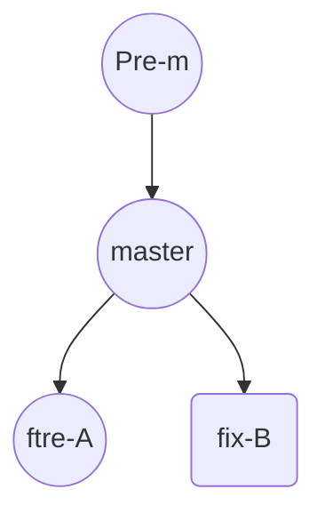
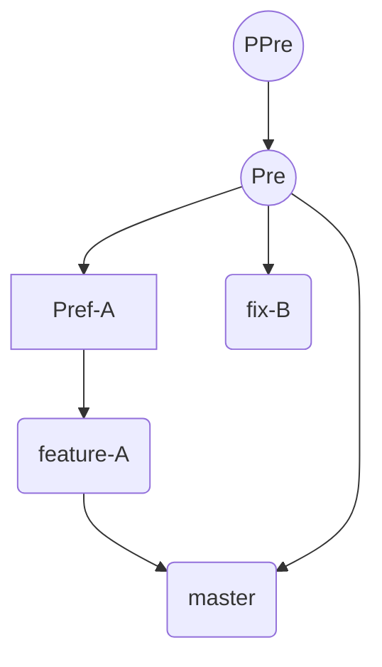

# 第四章　通过实际操作学习Git

## 4.1　基本操作

### git init——初始化仓库

&emsp;&emsp;要使用 Git 进行版本管理，必须先初始化仓库。Git 是使用 git init命令进行初始化的。请实际建立一个目录并初始化仓库。

```shell
$ mkdir git-tutorial
$ cd git-tutorial
$ git init
Initialized empty Git repository in /Users/hirocaster/github/github-book
/git-tutorial/.git/
```

&emsp;&emsp;如果初始化成功，执行了 git init命令的目录下就会生成 .git 目录。这个 .git 目录里存储着管理当前目录内容所需的仓库数据。
&emsp;&emsp;在 Git 中，我们将这个目录的内容称为“附属于该仓库的工作树”。文件的编辑等操作在工作树中进行，然后记录到仓库中，以此管理文件的历史快照。如果想将文件恢复到原先的状态，可以从仓库中调取之前的快照，在工作树中打开。开发者可以通过这种方式获取以往的文件。

### git status——查看仓库的状态

&emsp;&emsp;git status命令用于显示 Git 仓库的状态。这是一个十分常用的命令，请务必牢记。
&emsp;&emsp;工作树和仓库在被操作的过程中，状态会不断发生变化。

```shell
$ git status
# On branch master
#
# Initial commit
#
nothing to commit (create/copy files and use "git add" to track)
```

&emsp;&emsp;结果显示了我们当前正处于 master 分支下。接着还显示了没有可提交的内容。所谓提交（Commit），是指“记录工作树中所有文件的当前状态”。
&emsp;&emsp;现在尚没有可提交的内容，就是说当前我们建立的这个仓库中还没有记录任何文件的任何状态。这里，我们建立 README.md 文件作为管理对象，为第一次提交做前期准备。

```shell
$ touch README.md
$ git status
# On branch master
#
# Initial commit
## Untracked files:#   (use "git add <file>..." to include in what will
be committed)#
#       README.md
nothing added to commit but untracked files present (use "git add" to track)
```

&emsp;&emsp;将 README . md 文件加入暂存区后，git status命令的显示结果发生了变化。可以看到，README . md 文件显示在 Changes to be committed 中了。

### git commit——保存仓库的历史记录

&emsp;&emsp;git commit命令可以将当前暂存区中的文件实际保存到仓库的历史记录中。通过这些记录，我们就可以在工作树中复原文件。

#### 记述一行提交信息

```shell
$ git commit -m "First commit"
[master (root-commit) 9f129ba] First commit
  1 file changed, 0 insertions(+), 0 deletions(-)
  create mode 100644 README.md
```

-m 参数后的 "First commit"称作提交信息，是对这个提交的概述。

#### 记述详细提交信息

&emsp;&emsp;刚才只简洁地记述了一行提交信息，如果想要记述得更加详细，请不加 -m，直接执行 git commit 命令。执行后编辑器就会启动，并显示如下结果。

```shell
# Please enter the commit message for your changes. Lines starting
# with '#' will be ignored, and an empty message aborts the commit.
# On branch master
#
# Initial commit
#
# Changes to be committed:
#   (use "git rm --cached <file>..." to unstage)
#
#       new file:   README.md
```

在编辑器中记述提交信息的格式如下：

+ 第一行：用一行文字简述提交的更改内容
+ 第二行：空行
+ 第三行以后：记述更改的原因和详细内容

&emsp;&emsp;只要按照上面的格式输入，今后便可以通过确认日志的命令或工具看到这些记录。
&emsp;&emsp;在以 #（井号）标为注释的 Changes to be committed（要提交的更改）栏中，可以查看本次提交中包含的文件。将提交信息按格式记述完毕后，请保存并关闭编辑器，以 #（井号）标为注释的行不必删除。随后，刚才记述的提交信息就会被提交。

#### 中止提交

&emsp;&emsp;如果在编辑器启动后想中止提交，请将提交信息留空并直接关闭编辑器，随后提交就会被中止。

#### 查看提交后的状态

&emsp;&emsp;执行完 git commit命令后再来查看当前状态。

```shell
$ git status
# On branch master
nothing to commit, working directory clean
```

&emsp;&emsp;当前工作树处于刚刚完成提交的最新状态，所以结果显示没有更改。

### git log——查看提交日志

&emsp;&emsp;git log命令可以查看以往仓库中提交的日志。包括可以查看什么人在什么时候进行了提交或合并，以及操作前后有怎样的差别。

```shell
$ git log
    　
commit 9f129bae19b2c82fb4e98cde5890e52a6c546922
Author: hirocaster <hohtsuka@gmail.com>
Date:   Sun May 5 16:06:49 2013 +0900
    　
    First commit
```

#### 只显示提交信息的第一行

&emsp;&emsp;如果只想让程序显示第一行简述信息，可以在 git log命令后加上 --pretty=short。这样一来开发人员就能够更轻松地把握多个提交。

```shell
$ git log --pretty=short
        　
commit 9f129bae19b2c82fb4e98cde5890e52a6c546922
Author: hirocaster <hohtsuka@gmail.com>
        　
    First commit
```

#### 只显示指定目录、文件的日志

&emsp;&emsp;只要在 git log命令后加上目录名，便会只显示该目录下的日志。如果加的是文件名，就会只显示与该文件相关的日志。

```shell
git log README.md
```

#### 显示文件的改动

如果想查看提交所带来的改动，可以加上 -p参数，文件的前后差别就会显示在提交信息之后。

```shell
git log -p
```

&emsp;&emsp;执行下面的命令，就可以只查看 README.md 文件的提交日志以及提交前后的差别。

```shell
git log -p README.md
```

### git diff——查看更改前后的差别

&emsp;&emsp;git diff命令可以查看工作树、暂存区、最新提交之间的差别。

#### 查看工作树和暂存区的差别

&emsp;&emsp;执行 git diff 命令，查看当前工作树与暂存区的差别。

```shell
$ git diff
        　
diff --git a/README.md b/README.md
index e69de29..cb5dc9f 100644
--- a/README.md
+++ b/README.md
@@ -0,0 +1 @@
+# Git教程
```

&emsp;&emsp;由于我们尚未用 git add 命令向暂存区添加任何东西，所以程序只会显示工作树与最新提交状态之间的差别。
&emsp;&emsp;“+”号标出的是新添加的行，被删除的行则用“-”号标出。我们可以看到，这次只添加了一行。

#### 查看工作树和最新提交的差别

&emsp;&emsp;如果现在执行 git diff 命令，由于工作树和暂存区的状态并无差别，结果什么都不会显示。要查看与最新提交的差别，请执行以下命令。

```shell
$ git diff HEAD
diff --git a/README.md b/README.md
index e69de29..cb5dc9f 100644
--- a/README.md
+++ b/README.md
@@ -0,0 +1 @@
+# Git教程
```

&emsp;&emsp;不妨养成这样一个好习惯：在执行 git commit 命令之前先执行 git diff HEAD 命令，查看本次提交与上次提交之间有什么差别，等确认完毕后再进行提交。这里的 HEAD 是指向当前分支中最新一次提交的指针。

## 4.2　分支的操作

&emsp;&emsp;在进行多个并行作业时，我们会用到分支。在这类并行开发的过程中，往往同时存在多个最新代码状态。从 master 分支创建 feature-A 分支和 fix-B 分支后，每个分支中都拥有自己的最新代码。master 分支是 Git 默认创建的分支，因此基本上所有开发都是以这个分支为中心进行的。



&emsp;&emsp;不同分支中，可以同时进行完全不同的作业。等该分支的作业完成之后再与 master 分支合并。通过灵活运用分支，可以让多人同时高效地进行并行开发。




